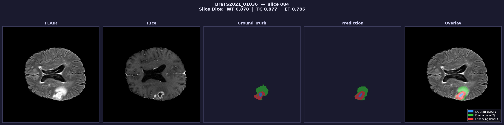
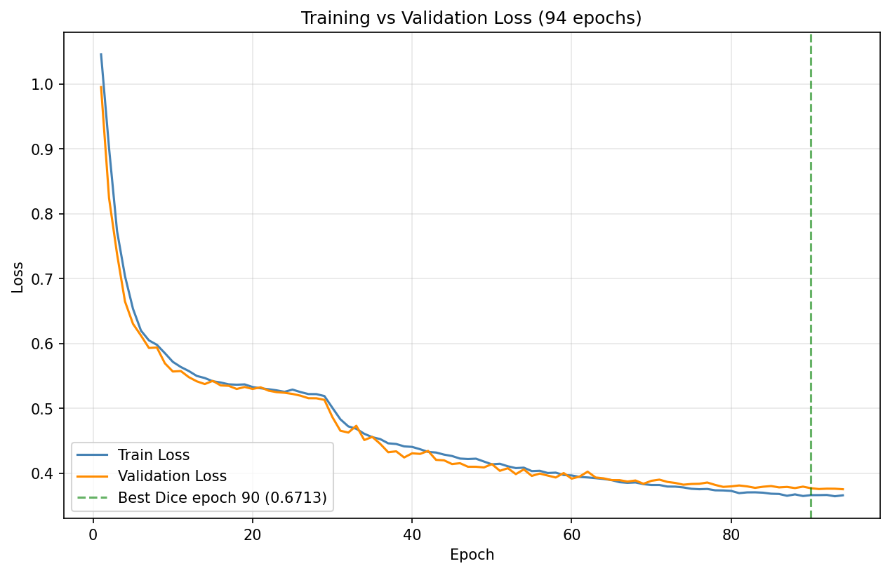
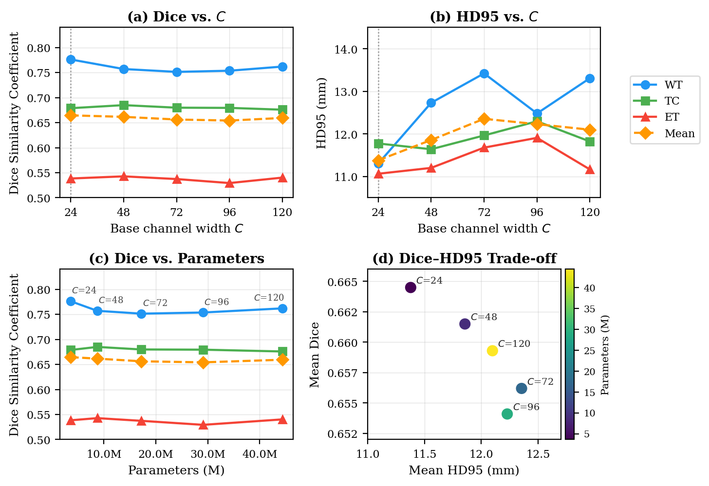

# SwinBraTS — Brain Tumor Segmentation with Swin Transformers
 

<!-- 
 -->
<p align="center">
    
    
</p>

 
---
 
## Overview
 
This project investigates how well the **Swin Transformer** adapts to the domain of **multi-modal medical image segmentation**.
The Swin Transformer was designed for natural RGB images, so applying it to four-channel MRI data requires non-trivial architectural decisions around input representation, spatial resolution, and volumetric output.
 
The core contribution is **SwinBraTS**, a U-Net-style encoder-decoder built around the **Swin Transformer Block** — the hierarchical windowed self-attention mechanism from the original paper.
Rather than adopting any one fixed model size, we evaluate a range of base channel widths $C \in \{24, 48, 72, 96, 120\}$ to study how model capacity interacts with the limited BraTS training data.
The architecture wraps the Swin backbone with a CNN-based Projection Block (fusing 4 MRI modalities into a 3-channel input) and a CNN-based Reconstruction Block (mapping 2D decoder features back to a 3D segmentation volume).
 
Performance is reported using **Dice Similarity Coefficient (DSC)** and **HD95** across the three standard BraTS evaluation regions: Whole Tumour, Tumour Core, and Enhancing Tumour.
 
---
 
## Dataset
 
**BraTS 2021 Task 1** — glioblastoma segmentation from multi-parametric MRI.
 
Each patient case provides four co-registered modalities (FLAIR, T1, T1ce, T2) at a resolution of 240×240×155, along with an expert-annotated voxel-wise tumour mask covering three subregions:
- **NCR/NET** — necrotic core and non-enhancing tumour (label 1)
- **Edema** — peritumoral oedema (label 2)
- **Enhancing tumour** — active tumour visible on T1ce (label 4)
 
The dataset contains ~1,200 patient cases and is available on Kaggle:
[https://www.kaggle.com/datasets/dschettler8845/brats-2021-task1](https://www.kaggle.com/datasets/dschettler8845/brats-2021-task1)
 
---
 
## Method
 
SwinBraTS processes each patient volume as follows:
 
1. **Projection Block** — four MRI modalities (each 155×240×240, depth treated as channels) are independently processed by per-modality CNN branches and fused into a single 3×224×224 representation.
2. **Swin Encoder** — three hierarchical stages of Swin Transformer Blocks downsample the representation from 56² to 7², doubling channels at each stage.
3. **Bottleneck** — two Swin Transformer Blocks at 7²×8C, where windowed attention covers the full spatial extent.
4. **Swin Decoder** — three upsampling stages with skip connections fusing encoder features at each scale.
5. **Reconstruction Block** — transposed convolutions restore spatial resolution to 240×240, a 1×1 convolution expands to 4×155 channels, and a reshape produces the final 4×155×240×240 logit volume. A lightweight Conv3d(3,1,1) layer adds inter-slice depth consistency.
 
Training uses a combined **Dice + Focal loss** to handle the severe class imbalance inherent in BraTS.
On-GPU augmentation (random flips, affine rotation, bias field) is applied each batch with no DataLoader overhead.
 
---

## Project Structure

```
swin-brats/
│
├── README.md
├── requirements.txt
├── train.sh                        # SLURM job script for DRAC H100
│
├── configs/
│   └── train_config.yml            # model + training hyperparameters
│
├── results/                        # per-run JSON result files
│   ├── C=24/
│   ├── C=48/
│   ├── C=72/
│   ├── C=96/
│   ├── C=120/
│   └── no-augmentation/
│
├── src/
│   ├── models/
│   │   ├── SwinTransformers/       # core Swin block components
│   │   │   ├── mlp.py
│   │   │   ├── swinTransformerBlock.py
│   │   │   ├── window_attention.py
│   │   │   └── window_utils.py
│   │   ├── projection_block.py     # modality projection (4 MRI → 3-channel)
│   │   ├── swinEncoder.py          # patch partition, merging, encoder stages
│   │   ├── bottleneck.py           # global attention at 7×7
│   │   ├── swinDecoder.py          # patch expanding, decoder stages
│   │   ├── skipConnection.py       # encoder-decoder skip fusion
│   │   ├── reconstruction_block.py # 2D features → 3D segmentation volume
│   │   ├── swinUNet.py             # full encoder-decoder backbone
│   │   └── swinBraTS_full.py       # end-to-end SwinBraTS model
│   │
│   ├── data/
│   │   ├── data_loader.py          # MRIDataset + collate function
│   │   └── preprocessing.py        # BraTSPreprocessor (.nii.gz → .npy)
│   │
│   ├── training/
│   │   ├── train.py                # main training script
│   │   ├── trainer.py              # SwinTrainer class (train/val/test loops)
│   │   └── gpu_augmentation.py     # on-GPU flip, affine, bias field
│   │
│   └── utils/
│       ├── losses.py               # Dice + Focal loss (MONAI)
│       ├── metrics.py              # DSC and HD95 for BraTS regions
│       └── config.py               # YAML config loader
│
└── visualization/
    ├── plot_c_ablation.py          # C parameter ablation plots
    ├── visualize.py                # per-sample prediction visualizer
    └── visualize_extremes.py       # best/worst test case comparison
```

---

## Getting Started
 
**1. Create and activate a virtual environment (if needed)**
```bash
python -m venv myenv
source myenv/bin/activate        # Linux / Mac
myenv\Scripts\activate           # Windows
```
 
**2. Install dependencies**
```bash
pip install -r requirements.txt
```

**3. Download and preprocess the dataset**

Download BraTS 2021 Task 1 from [Kaggle](https://www.kaggle.com/datasets/dschettler8845/brats-2021-task1) and extract it, then run:
```bash
python -m src.data.preprocessing \
  --data_dir path/to/BraTS2021_Training_Data \
  --output_dir data/processed/brats
```
 
**4. Configure the run**
 
Edit `configs/train_config.yml` to set your data paths, model size (`C`), batch size, and number of epochs before running.
 
**5. Run** (all commands from the repository root)
 
```bash
# Training, validation, test evaluation, and loss plot — all in one
python -m src.training.train
 
# Visualize n random cases from the test set
python visualization/visualize.py \
    --n 2 \
    --checkpoint checkpoints/best_model.pth \
    --out_dir results/viz
 
# Visualize the best and worst predicted cases
python visualization/visualize_extremes.py \
    --metric mean_dice \
    --checkpoint checkpoints/best_model.pth \
    --out_dir results/viz
```
 
On a SLURM cluster (e.g. DRAC H100):
```bash
sbatch train.sh
```

*Note*: before running `train.sh`, update line 12 with the environment path on your machine.

---

## Authors

**COMP 4360 — Dr. Cristopher Henry**  
**Group 5:**  
- Duc Do - dod2@myumanitoba.ca
- Jordon Hong - hongj1@myumanitoba.ca
- Muhammad Safdar - Muhammad.Safdar@umanitoba.ca

---

## Acknowledgements
 
- Liu et al., *Swin Transformer: Hierarchical Vision Transformer using Shifted Windows*, ICCV 2021
- BraTS 2021 dataset: [https://www.kaggle.com/datasets/dschettler8845/brats-2021-task1](https://www.kaggle.com/datasets/dschettler8845/brats-2021-task1)
- Swin Transformer backbone implementation sourced from [Microsoft/Swin-Transformer](https://github.com/microsoft/Swin-Transformer/tree/main/models)
